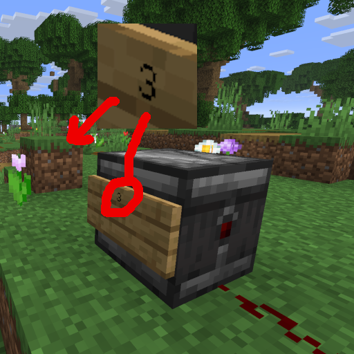

## Compatibility

Tested on Spigot-1.20.5, 1.21.

## Introduction

Increases Observer work distance

## Features

1. Put a wall sign on an observer
2. Write down a distance from 2 to the server simulation distance in blocks
3. Check console for aiming confirmation

## Commands

`customobserver reload` - reload config from disk

## Permissions

* Access to 'reload' command:
`customobserver.reload` (default: op)

## Configuration
[Default configuration file](src/main/resources/config.yml)

## Author
I will be happy to add some features or fix bugs. My mail: uprial@gmail.com.

## Useful links
* [Project on GitHub](TBD)
* [Project on Bukkit Dev](TBD)
* [Project on Spigot](TBD)

## Related projects
* AutoMinecart: [Bukkit Dev](https://legacy.curseforge.com/minecraft/bukkit-plugins/auto-minecart/) [GitHub](https://github.com/uprial/autominecart), [Spigot](https://www.spigotmc.org/resources/autominecart.128389/)
* CustomBazookas: [Bukkit Dev](https://legacy.curseforge.com/minecraft/bukkit-plugins/custombazookas/) [GitHub](https://github.com/uprial/custombazookas), [Spigot](https://www.spigotmc.org/resources/custombazookas.124997/)
* CustomCreatures: [Bukkit Dev](http://dev.bukkit.org/bukkit-plugins/customcreatures/), [GitHub](https://github.com/uprial/customcreatures), [Spigot](https://www.spigotmc.org/resources/customcreatures.68711/)
* CustomNukes: [Bukkit Dev](http://dev.bukkit.org/bukkit-plugins/customnukes/), [GitHub](https://github.com/uprial/customnukes), [Spigot](https://www.spigotmc.org/resources/customnukes.68710/)
* CustomRecipes: [Bukkit Dev](https://dev.bukkit.org/projects/custom-recipes), [GitHub](https://github.com/uprial/customrecipes/), [Spigot](https://www.spigotmc.org/resources/customrecipes.89435/)
* CustomVillage: [Bukkit Dev](http://dev.bukkit.org/bukkit-plugins/customvillage/), [GitHub](https://github.com/uprial/customvillage/), [Spigot](https://www.spigotmc.org/resources/customvillage.69170/)
* MasochisticSurvival: [Bukkit Dev](https://legacy.curseforge.com/minecraft/bukkit-plugins/masochisticsurvival/), [GitHub](https://github.com/uprial/masochisticsurvival/), [Spigot](https://www.spigotmc.org/resources/masochisticsurvival.124943/)
* TakeAim: [Bukkit Dev](https://dev.bukkit.org/projects/takeaim), [GitHub](https://github.com/uprial/takeaim), [Spigot](https://www.spigotmc.org/resources/takeaim.68713/)
